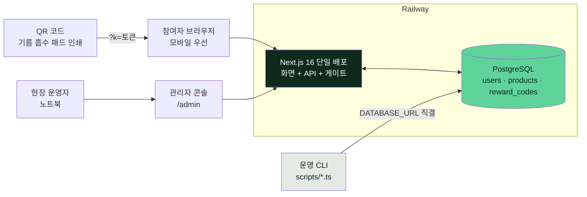
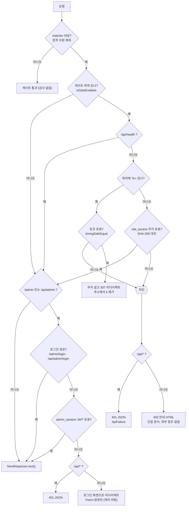
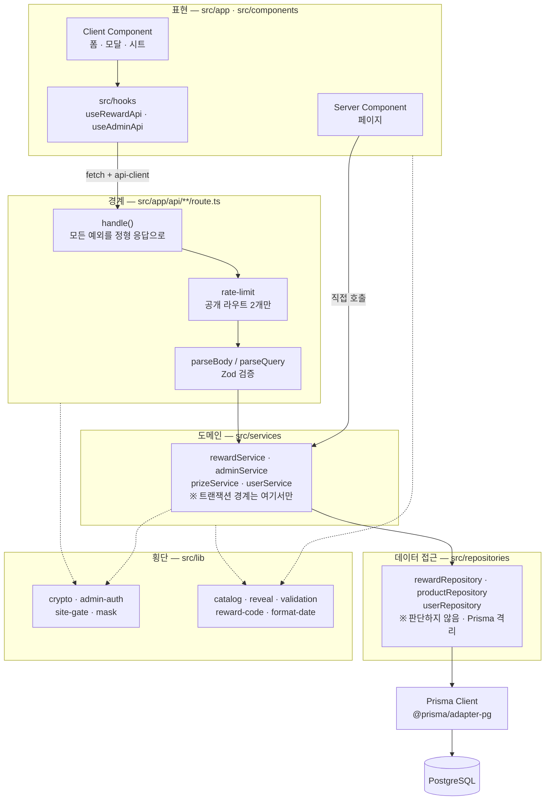
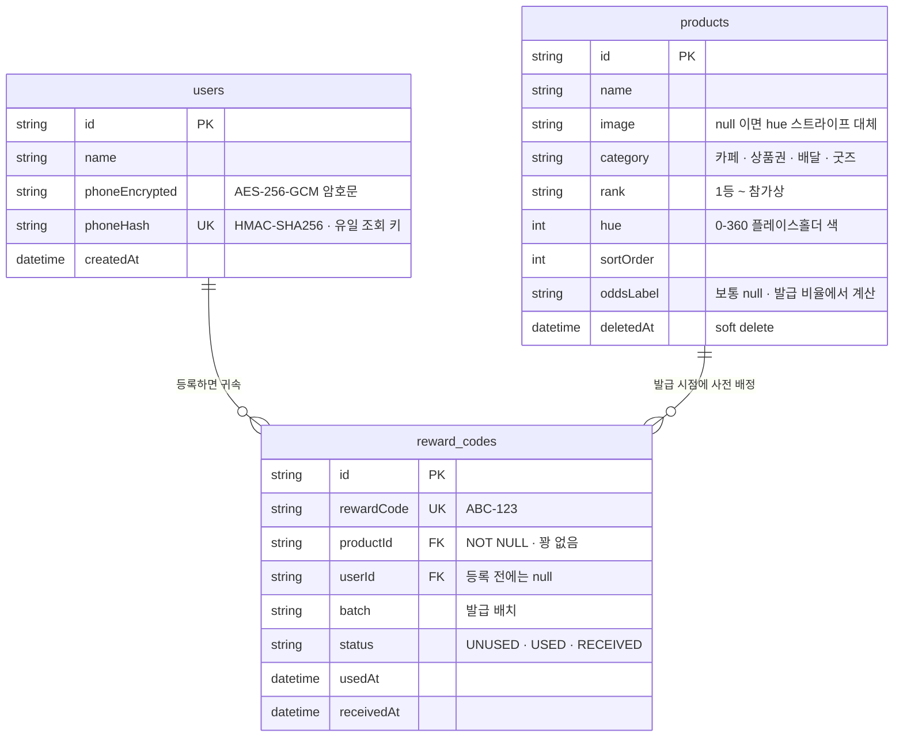
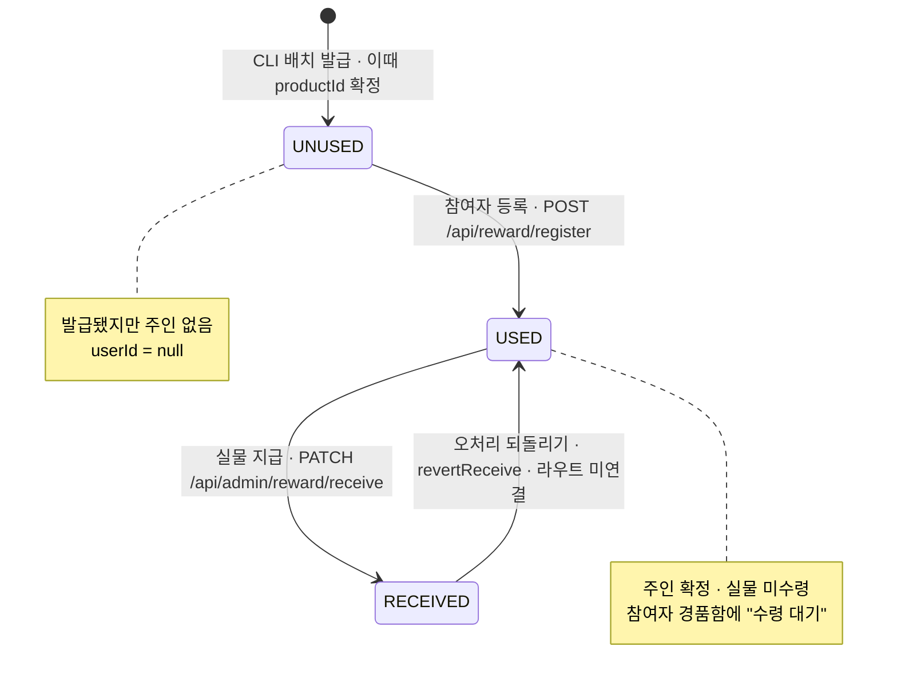
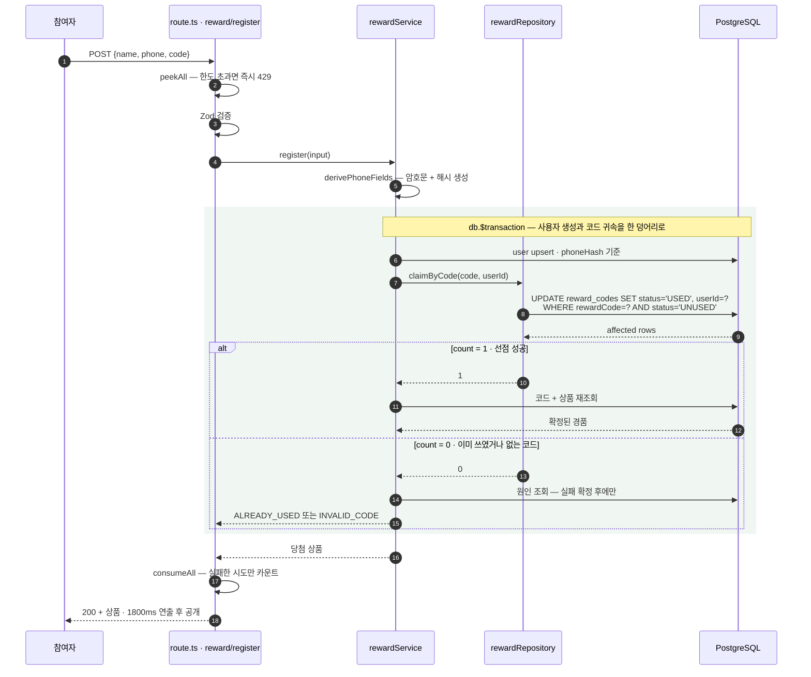
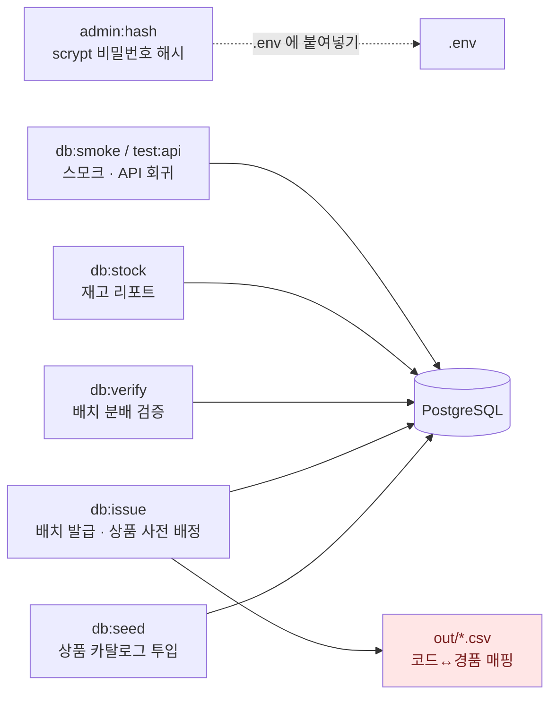
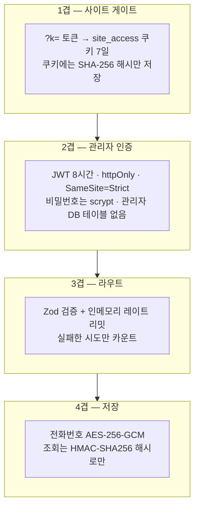

# 아키텍처 스냅샷

> **상태: 동결 — 2026-09-03 시점의 구조 기록입니다.**
> 코드에서 역산했습니다. 구조가 바뀌면 이 문서를 고치지 말고,
> 변경 사실은 [`implementation-plan.md`](../implementation-plan.md) 에 기록한 뒤
> 필요하면 새 스냅샷을 뜨세요. **충돌하면 코드가 기준입니다.**
>
> 작성 2026-09-03 · 이후 갱신 없음
> 선행 근거: `src/` 전수 · `prisma/schema.prisma` · `src/proxy.ts` · `package.json`
> 관련: [`docs/prd.html`](../prd.html)(제품 관점) · [`docs/implementation-plan.md`](../implementation-plan.md)(결정의 이유) · [`docs/phase5-admin-estimate.md`](../phase5-admin-estimate.md)(관리자 영역)

기름 흡수 패드에 인쇄된 QR 로 들어와 **리워드 코드를 등록하면 경품이 확정되는** 캠페인 웹앱입니다.
이 문서는 "무엇이 어디에 있고 요청이 어떻게 흐르는가" 만 다룹니다.
**왜 그렇게 했는가**는 `implementation-plan.md` 의 확정 결정사항 표에 있습니다.

---

## 1. 시스템 컨텍스트



**단일 배포입니다.** 프론트·API·인증 게이트가 한 Next.js 프로세스 안에 있고, 별도 백엔드 서버가 없습니다.

**쓰기 권한이 둘로 갈려 있습니다.** 화면에서 할 수 있는 쓰기는 사실상 두 가지 —
참여자의 **코드 등록**과 운영자의 **실물 지급 처리** 뿐입니다.
상품 등록·코드 배치 발급·CSV 추출은 의도적으로 UI 를 만들지 않고 **CLI 로만** 남겼습니다.
현장에서 실수로 누를 수 있는 위험한 조작을 화면에서 아예 없애는 쪽을 택한 결과입니다.

---

## 2. 요청 게이트 — `src/proxy.ts`

모든 요청이 두 겹의 관문을 지납니다. **사이트 게이트가 먼저**고, 관리자 인증이 그 위에 얹힙니다.



**파일 이름이 `middleware.ts` 가 아닙니다.** Next 16 에서 middleware 는 Edge 런타임이라
`jsonwebtoken` 과 `node:crypto` 를 쓸 수 없습니다 — 빌드는 경고만 내고 통과한 뒤 런타임에 터집니다.
`proxy.ts` 는 항상 Node.js 런타임이라 토큰 검증을 그대로 합니다.
그래서 **이 파일에는 `runtime` 세그먼트 설정을 넣으면 안 됩니다.** 빌드가 거부합니다.

**게이트에 관리자 예외를 두지 않았습니다.** 운영자도 노트북에서 QR 링크로 한 번 들어와
쿠키를 받아야 합니다. 이 한 번의 마찰을 감수한 이유는 단순합니다 — 예외 경로는 늘어날수록 빠뜨리기 쉽습니다.

**인증 실패의 응답 형식만 소비자에 맞춥니다.** 만료·위조·부재는 구분하지 않습니다(공격자에게 힌트가 됩니다).
다만 `fetch` 에는 `ApiFailure` JSON 을, 브라우저 내비게이션에는 로그인 화면을 돌려줍니다.
토큰 TTL 이 8시간이라 현장 운영 중 반드시 한 번은 만료되는데, 페이지에까지 401 JSON 을 주면
화면이 깨진 채 멈추고 리다이렉트면 스스로 복구되기 때문입니다.

---

## 3. 레이어 구조



레이어별 책임과, 그 경계를 지키기 위해 **금지한 것**:

| 레이어 | 하는 일 | 하지 않는 일 |
|---|---|---|
| Route Handler | 검증 · 레이트 리밋 · 응답 규격 | 도메인 판단, Prisma 직접 호출 |
| Service | 상태 전이 규칙, **트랜잭션 경계** | 요청/응답 객체를 아는 것 |
| Repository | Prisma 쿼리 격리 | **판단.** 던지지 않고 count·null 만 돌려줍니다 |
| lib | 암호화, 순수 계산 | DB 접근 |

**Repository 는 판단하지 않습니다.** "코드가 이미 쓰였다"는 결론은 Service 가 내립니다 —
Repository 는 `updateMany` 가 몇 행을 바꿨는지만 돌려줍니다.
문서화된 예외는 `productRepository.softDelete()` 하나뿐입니다.

**서버 컴포넌트는 자기 API 를 `fetch` 하지 않습니다.** 같은 프로세스 안이므로 Service 를 직접 부릅니다.
`api/` 는 브라우저용 경계이지 내부 호출용이 아닙니다.

---

## 4. 데이터 모델



이 스키마에 담긴 결정 세 가지:

**`productId` 가 NOT NULL 입니다.** 발급 시점에 상품이 확정됩니다 — 사전 배정이고, **꽝이 없습니다.**
등록 요청이 들어왔을 때 서버가 추첨하는 코드는 어디에도 없습니다.
화면의 1800ms 두근거림은 **순수 연출**입니다.

**재고 컬럼이 없습니다.** 남은 수량과 확률은 항상 `reward_codes` 를 세어 파생합니다.
저장했다가 실제와 어긋난 적이 있어서(표시 86%, 실제 100%) 저장하지 않기로 했습니다.

**전화번호가 두 컬럼으로 쪼개져 있습니다.** 복호화용 `phoneEncrypted`(AES-256-GCM)와
조회용 `phoneHash`(HMAC-SHA256, UNIQUE)입니다. AES 는 같은 입력이 매번 다른 암호문이 되어
조회 키로 쓸 수 없기 때문입니다. `phoneHash` 는 결정적이라 인덱스가 걸립니다.

> ⚠️ **`PHONE_ENCRYPTION_KEY` · `PHONE_HMAC_SECRET` 은 출시 후 절대 교체할 수 없습니다.**
> 교체하면 기존 데이터를 복호화할 수 없고 기존 사용자를 다시 찾을 수도 없습니다.

---

## 5. 리워드 상태 머신



**세 전이 모두 조건부 `updateMany` + 영향 행 수로 판정합니다.**
"먼저 읽어서 확인하고 그다음 쓴다" 는 절차가 어디에도 없습니다 — 확인은 DB 가 합니다.
읽기와 쓰기 사이에 다른 요청이 끼어들 틈을 아예 만들지 않는 것이 목적입니다.

---

## 6. 코드 등록 흐름 (동시성 핵심 경로)



**`WHERE status='UNUSED'` 한 줄이 동시성 방어의 전부입니다.**
같은 코드로 열 명이 동시에 눌러도 UPDATE 를 성사시키는 것은 한 명이고, 나머지는 `count = 0` 을 받습니다.
락도, 재시도 루프도 필요 없습니다.

**실패 원인 조회는 실패가 확정된 뒤에만 합니다.** 정상 경로에서는 추가 쿼리가 발생하지 않습니다.

**사용자 생성과 코드 귀속이 한 트랜잭션입니다.** 코드가 이미 쓰인 경우 사용자만 덩그러니
생성되면 안 됩니다 — 잘못 입력한 사람의 전화번호를 저장할 이유가 없습니다.

**`P2002` 는 한 번만 봐줍니다.** 같은 번호의 첫 등록이 동시에 들어와 `phoneHash` UNIQUE 에
걸린 경우인데, 재시도하면 upsert 가 기존 행을 찾아 정상 진행합니다.
계속 실패한다면 경합이 아니라 다른 문제입니다.

---

## 7. 라우트 맵

### 화면

| 경로 | 파일 | 게이트 | 관리자 인증 |
|---|---|---|---|
| `/` | `(app)/page.tsx` | ✅ | — |
| `/tip` `/about` `/support` `/mypage` | `(app)/*/page.tsx` | ✅ | — |
| `/admin/login` | `admin/login/page.tsx` | ✅ | **면제** (토큰 받으러 오는 곳) |
| `/admin` `/admin/codes` `/admin/prizes` `/admin/wins` | `admin/(console)/*` | ✅ | ✅ |

사용자 앱은 `(app)` 라우트 그룹이 `ShellContext` 를 제공하는 공통 셸(440px)을 씌우고,
관리자 콘솔은 `(console)` 그룹이 사이드바 레이아웃을 씌웁니다. **두 셸은 서로 공유되지 않습니다.**

### API

| 메서드 | 경로 | 서비스 | 레이트 리밋 |
|---|---|---|---|
| `POST` | `/api/reward/register` | `rewardService.register` | ✅ `REGISTER_LIMITS` |
| `POST` | `/api/reward/lookup` | `rewardService.lookup` | ✅ `LOOKUP_LIMITS` |
| `GET` | `/api/prizes` | `prizeService.listPublic` | — |
| `GET` | `/api/health` | — | **게이트 면제** |
| `POST` | `/api/admin/login` | `adminService.login` | 게이트만 |
| `POST` | `/api/admin/logout` | — | ✅ |
| `GET` | `/api/admin/dashboard` | `adminService.getDashboard` | ✅ |
| `POST` | `/api/admin/reward/lookup` | `rewardService.lookupForAdmin` | ✅ · **의도적 제외** |
| `PATCH` | `/api/admin/reward/receive` | `rewardService.receive` | ✅ |
| `GET` `POST` | `/api/admin/product` | `adminService.listProducts` · `createProduct` | ✅ |
| `PATCH` `DELETE` `POST` | `/api/admin/product/[id]` | `update` · `delete` · `restore` | ✅ |
| `GET` `POST` | `/api/admin/reward-code` | `listBatches` · `issueCodes` | ✅ |
| `GET` | `/api/admin/user` | `userService.listForAdmin` | ✅ |

**관리자 조회에 레이트 리밋을 걸지 않은 것은 의도입니다.** 공개 조회는 전화번호 순회를 막아야
하지만, 이 경로는 이미 인증을 통과한 뒤이고 현장에서 연달아 조회하는 것이 정상 사용입니다.

> ⚠️ **레이트 리밋은 인메모리 슬라이딩 윈도우입니다.** 프로세스 안에만 존재하므로
> **단일 인스턴스를 전제**합니다. 인스턴스를 늘리면 한도가 인스턴스 수만큼 곱해집니다.

---

## 8. 운영 CLI



> 🔒 **`out/*.csv` 는 답안지입니다.** 코드↔경품 매핑이 그대로 들어 있어, 유출되면
> 어떤 코드가 1등인지 사전에 알 수 있습니다. `.gitignore` 가 `/out` 을 막고 있고,
> **어떤 문서에도 실제 발급 코드를 적지 않습니다.**

발급 코드 공간: `ABCDEFGHJKLMNPQRSTUVWXYZ`(24자, `I`·`O` 제외) × `23456789`(8자, `0`·`1` 제외).
`ABC-123` 형식으로 **7,077,888 조합**입니다. 손으로 옮겨 적을 때 헷갈리는 글자를 뺀 결과입니다.
생성은 `crypto.randomInt` + Fisher-Yates 를 씁니다.

---

## 9. 보안 요약



모든 비밀값 비교는 `crypto.timingSafeEqual` 을 씁니다.
`scrypt` 해시는 `scrypt:saltHex:hashHex` 로 **콜론 구분**입니다 — `$` 를 쓰면 `.env` 변수 확장이 걸립니다.

**관리자 계정 테이블이 없습니다.** 비밀번호 해시가 환경변수에 있고, 계정은 하나뿐입니다.
운영 인원이 소수이고 계정 관리 화면을 만들 이유가 없어서 내린 결정입니다.

> ⚠️ **알려진 갭 — 2026-09-03 시점, 미조치.**
> 관리자 **화면**은 `proxy.ts` 와 `(console)/layout.tsx` 두 겹으로 보호되지만,
> 관리자 **API 7개**는 `proxy.ts` 한 겹뿐입니다. `admin-guard.ts` 의 `isAdminAuthenticated()`
> 를 핸들러 안에서 부르는 곳이 없습니다. matcher 정규식이 확장자로 끝나는 경로를 제외하기
> 때문에, 그런 모양의 경로가 생기면 게이트를 우회합니다.
> 자세한 내용과 재현은 `implementation-plan.md` 를 보세요.

---

## 10. 디렉터리

```
src/
├─ proxy.ts               ⚠️ middleware.ts 아님 · runtime 설정 금지
├─ app/
│  ├─ (app)/              사용자 앱 — 440px 셸 · ShellContext
│  ├─ admin/(console)/    관리자 콘솔 — 사이드바 레이아웃
│  └─ api/                Route Handler 13개
├─ components/
│  ├─ shell/              AppShell · Intro · Drawer · PrizeSheet · RevealModal
│  ├─ home/ mypage/ form/ prize/ support/
│  └─ admin/              AdminTable(4곳 공유) · AdminWinCards 등
├─ services/              도메인 로직 · 트랜잭션 경계
├─ repositories/          Prisma 격리 · 판단하지 않음
├─ lib/                   암호화 · 게이트 · 검증 · 순수 계산
├─ hooks/                 useRewardApi · useAdminApi · useDialog
├─ types/                 dto.ts · reward.ts
└─ generated/prisma/      ⚠️ 생성물 · 직접 수정 금지 (postinstall 이 덮어씀)

prisma/schema.prisma      마이그레이션 1개 (20260807004059_init)
scripts/                  운영 CLI 8개
public/assets/            16개 · 전부 참조됨
```

**`src/generated/prisma/` 는 생성물입니다.** `postinstall` 의 `prisma generate` 가 덮어쓰므로
직접 고치면 다음 설치에서 사라집니다. 경로 별칭은 `@/*` → `src/*` 입니다.

---

## 11. 이 구조를 건드릴 때 확인할 것

| 하려는 일 | 먼저 볼 곳 |
|---|---|
| 새 정적 파일 형식 추가 | `proxy.ts` matcher 확장자 목록 — 빠뜨리면 게이트가 걸립니다 |
| 인스턴스 늘리기 | `rate-limit.ts` — 인메모리라 한도가 곱해집니다 |
| 상품 추가·삭제 | 화면이 아니라 CLI. 확률은 발급 비율에서 자동 파생됩니다 |
| 관리자 API 추가 | `proxy.ts` 한 겹뿐입니다. 핸들러 안에서 `isAdminAuthenticated()` 를 부르세요 |
| 문서 절 번호 변경 | `phase5-admin-estimate.md` 는 소스 9곳이 절 번호를 인용합니다 |
| 암호화 키 교체 | **하지 마세요.** 기존 데이터가 복구 불능이 됩니다 |
